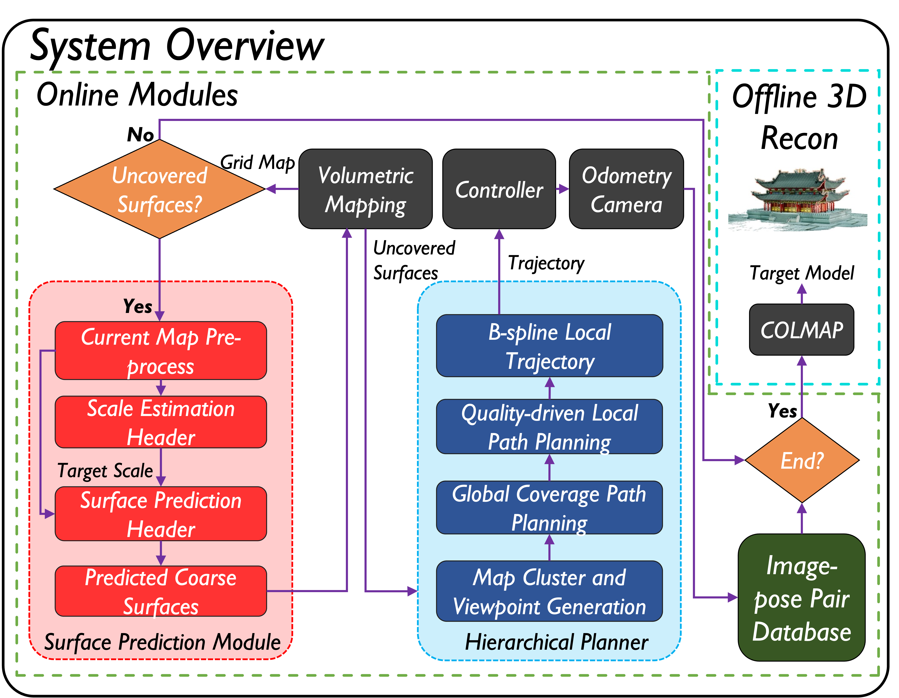
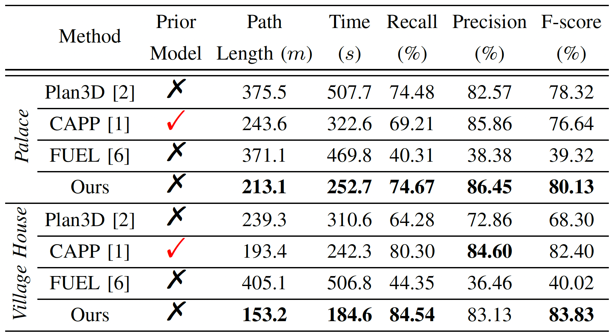

# PredRecon

## 📢 News

* 20/06/2023: The code of Hierarchical Planner is available.
* 06/06/2023: The simulator (AirSim) is available.
* 10/02/2023: The code of Surface Prediction Module (SPM) is available.

## 📜 Introduction

**[ICRA'23]** This repository maintains the implementation of "PredRecon: A Prediction-boosted Planning Framework for Fast and High-quality Autonomous Aerial Reconstruction".

<div align=center></div>

**Paper**: [arXiv](https://arxiv.org/pdf/2302.04488.pdf), [IEEE](https://ieeexplore.ieee.org/document/10160933)

**Complete video**: [Video](https://www.youtube.com/watch?v=ek7yY_FZYAc)

**Authors**: [Chen Feng](https://chen-albert-feng.github.io/AlbertFeng.github.io/), Haojia Li, [Fei Gao](http://zju-fast.com/fei-gao/), [Boyu Zhou](https://boyuzhou.net/), and [Shaojie Shen](https://uav.hkust.edu.hk/group/).

**Institutions**: [HKUST Aerial Robotics Group](https://uav.hkust.edu.hk/), [SYSU STAR Group](https://boyuzhou.net/), and [ZJU FASTLab](http://zju-fast.com/fei-gao/).

Please cite our paper if you use this project in your research:

* [PredRecon: A Prediction-boosted Planning Framework for Fast and High-quality Autonomous Aerial Reconstruction](https://ieeexplore.ieee.org/document/10160933), Chen Feng, Haojia Li, Fei Gao, Boyu Zhou, and Shaojie Shen, 2023 IEEE International Conference on Robotics and Automation (ICRA).

```
@inproceedings{feng2023predrecon,
  title={PredRecon: A Prediction-boosted Planning Framework for Fast and High-quality Autonomous Aerial Reconstruction},
  author={Feng, Chen and Li, Haojia and Gao, Fei and Zhou, Boyu and Shen, Shaojie},
  booktitle={2023 IEEE International Conference on Robotics and Automation (ICRA)},
  pages={1207-1213},
  year={2023},
  organization={IEEE}
}
```

**PredRecon** is a prediction-boosted planning framework that can efficiently reconstruct high-quality 3D models for the target areas in unknown environments with a single flight. We obtain inspiration from humans can roughly infer the complete construction structure from partial observation. Hence, we devise a surface prediction module (SPM) to predict the coarse complete surfaces of the target from current partial reconstruction. Then, the uncovered surfaces are produced by online volumetric mapping waiting for the observation by UAV. Lastly, a hierarchical planner plans motions for 3D reconstruction, which sequentially find efficient global coverage paths, plans local paths for maximizing the performance of Multi-View Stereo (MVS) and generate smooth trajectories for image-pose pairs acquisition. We conduct benchmark in the realistic simulator, which validates the performance of PredRecon compared with classical and state-of-the-art methods.

<p align="center">
  
  
  
  
</p>

<div align=center></div>

Please kindly star ⭐️ this project if it helps you. We take great efforts to develop and maintain it 😁.

## 🛠️ Installation

The project has been tested on Ubuntu 20.04 LTS (ROS Noetic). Directly clone our package (using ssh here):

```
  cd ${YOUR_WORKSPACE_PATH}/src
  git clone https://github.com/HKUST-Aerial-Robotics/PredRecon.git
```

Then install individual components of **PredRecon**:

* To install Surface Prediction Module, please follow the steps in [SPM](./SPM/README.md).
* To install Hierarchical Planner, please follow the steps in [Planner](./Planner/README.md).

## 🚀 Quick Start

You can decide whether saving captured images by changing the parameter ```reconfsm/img_flag``` in [algorithm.xml](./Planner/Code/src/predrecon/exploration_manager/launch/algorithm.xml), where ```true``` for saving and ```false``` for not saving.
Note: If you set such parameter as ```true```, all captured images will be saved in ```reconfsm/img_dir_```, which can be changed to your own path in [algorithm.xml](./Planner/Code/src/predrecon/exploration_manager/launch/algorithm.xml).

Open your Unreal Engine platform, then run AirSim simulator in the terminal:

```
  source devel/setup.zsh && roslaunch airsim_ros_pkgs airsim_node.launch
```

Firstly, run ``Rviz`` for trajectory visualization:

```
  source devel/setup.zsh && roslaunch exploration_manager rviz.launch
```

Then, run the simulation:

```
  source devel/setup.zsh && roslaunch exploration_manager recon.launch
```

Trigger the quadrotor to start flight for collecting information by the ``2D Nav Goal`` tool in ``Rviz``.

After the flight, all images-pose pairs captured is stored in your given folder. We recommend [RealityCapture](https://www.capturingreality.com/) or [COLMAP](https://github.com/colmap/colmap) as the 3D reconstruction platform. If you want to uae COLMAP in your terminal, you can follow the usage example in [COLMAP Usage](Planner/Code/src/predrecon/plan_manage/script/3D_Colmap.md).

## 💥 Known Issues

You can simply verify whether your AirSim is working properly

```
  source devel/setup.zsh && roslaunch airsim_ros_pkgs airsim_node.launch
  source devel/setup.zsh && roslaunch exploration_manager rviz.launch
  source devel/setup.zsh && roslaunch exploration_manager init_test.launch
```

If AirSim is working correctly, you will see the initial flight of the drone and the mapping results in both AirSim and Rviz.

## ❣️ Acknowledgements

We use **NLopt** for non-linear optimization, use **LKH** for travelling salesman problem, and thank the source code of **mmdetection3d** and **[FUEL](https://github.com/HKUST-Aerial-Robotics/FUEL)**.

## 🤗 FC-family Works

#### 1. What is FC-family?

We aim to develop intelligent perception-centric flight to realize ***F***ast ***C***overage / re***C***onstruction / inspe***C***tion etc.

#### 2. Projects list

* [PredRecon](https://github.com/HKUST-Aerial-Robotics/PredRecon) (ICRA2023): Prediction-boosted Planner for Aerial Reconstruction.
* [FC-Planner](https://github.com/HKUST-Aerial-Robotics/FC-Planner) (ICRA2024): Highly Efficient Global Planner for Aerial Coverage.
* [SOAR](https://github.com/SYSU-STAR/SOAR) (IROS2024): Heterogenous Multi-UAV Planner for Aerial Reconstruction.
