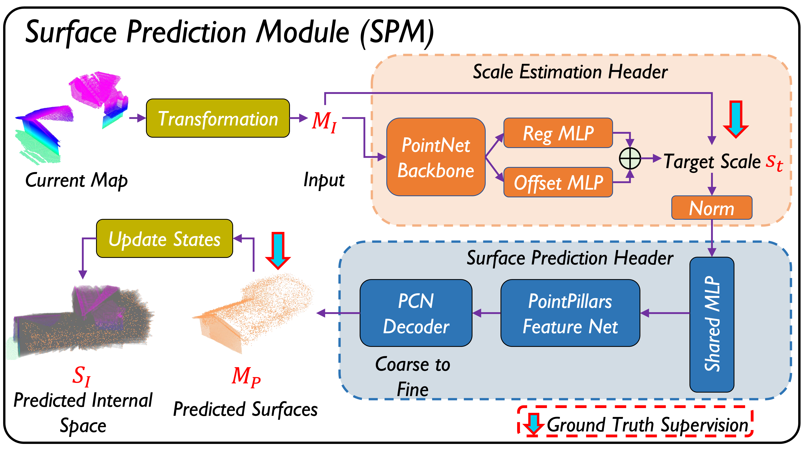

# SPM in PredRecon

## Introduction

<p align="center">
  
  
</p>

This is implementation of *Surface Prediction Module* (SPM) in **PredRecon** in PyTorch.

## Environment

* Ubuntu 20.04 LTS
* Python 3.8.3
* PyTorch 1.10.0 & torchvision 0.11.0
* CUDA 11.3
* NVIDIA RTX 3070Ti (Single GPU)

## Prerequisite

Compile for cd and emd:

```shell
conda create -n spm python=3.8
cd extensions/chamfer_distance
python3 setup.py install
cd ../earth_movers_distance
python3 setup.py install
```

As for other modules, please install by:

```shell
pip3 install -r requirements.txt
```

## PointPillars Compilation

```shell
cd ops
python3 setup.py develop
```

If you cannot find *libtorch_cuda_cu.so*, you should remove *build*, *pointpillars.egg-info* and *.so* folders and files then compile ops again.

## Data generation

For example: [House3K dataset](https://drive.google.com/drive/folders/1fb5gGBxFIibvHrsJGquO6N8rqKSbkIZB) processed by [Blender 2.76](https://download.blender.org/release/Blender2.76/)

```shell
cd dataset/generation
```

**PIPELINE**: fbx2obj --> obj_norm --> blender sampling depth for partial pcd --> complete obj2pcd --> depth2pcd

## Training

In order to train the model (both *Scale Estimation Header* & *Surface Prediction Header*), please use script:

```shell
conda activate spm
python3 train.py --exp_name xxx_sph --lr 0.0001 --epochs 200 --batch_size 16 --coarse_loss cd --num_workers 8 --mode train --header sph &
python3 train.py --exp_name xxx_seh --lr 0.0001 --epochs 200 --batch_size 16 --coarse_loss cd --num_workers 8 --mode train --header seh
```

If you want to use emd to calculate the distances between coarse point clouds, please use script:

```shell
python3 train.py --exp_name xxx_sph --lr 0.0001 --epochs 200 --batch_size 16 --coarse_loss emd --num_workers 8 --mode train --header sph &
python3 train.py --exp_name xxx_seh --lr 0.0001 --epochs 200 --batch_size 16 --coarse_loss emd --num_workers 8 --mode train --header seh
```

## Testing

In order to test the model (both *Scale Estimation Header* & *Surface Prediction Header*), please use follow script:

```shell
python3 train.py --exp_name xxx_sph --ckpt_path log/xxx_sph/all/checkpoints/best_l1_cd.pth --batch_size 16 --num_workers 8 --mode test --header sph &
python3 train.py --exp_name xxx_seh --ckpt_path log/xxx_seh/all/checkpoints/last_epoch.pth --batch_size 16 --num_workers 8 --mode test --header seh
```

## Convert model to C++ lib

In order to embed SPM into PredRecon, we distill the trained SPM model into a smaller standard PyTorch model without external python library. Besides, libtorch is used to enable the model in C++ environment. Please follow:

```shell
python3 distillation.py --exp_name distill --teacher_path log/teacher/all/checkpoints/best_l1_cd.pth --epochs 100 --batch_size 8 --coarse_loss cd --num_workers 8 --mode train &
python3 lib_predictor.py --ckpt_path log/xxx_sph(xxx_seh)/all/checkpoints/best_l1_cd.pth --header sph(or seh) --save_path /home/albert/SPM/sph(or seh).pt
```

Note: You should change the example path as your own path in your workspace.

## Results & Comparison

* All results are tested on single NVIDIA RTX 3070Ti.

1. Experiments are conducted on test set of [ShapeNet](https://drive.google.com/file/d/1OvvRyx02-C_DkzYiJ5stpin0mnXydHQ7/view) with 400 epochs.

* Seen Categories

| Name                         | FLOPs(G) | Params(M) | InferLatency(ms)| L1_CD(1e-3m) $\downarrow$  | L2_CD(1e-4m) $\downarrow$ | F-Score(%) $\uparrow$ | 
|---------------------------------------------|:-------:|:-------:|:-------:|:---------:|:-------:|:-------:|
|[PCN](https://arxiv.org/pdf/1808.00671.pdf)           |    13.27 |   28.91  | ~4|10.4897  |  4.7431 |  65.7207 |
|SPM|    20.60 |  28.20    | ~6| **9.4461** |  **3.9368** |  **68.6693**  |
|SPM_Distill <br /> (100 epochs)|    7.87 |  14.09    | ~3| 9.7572 |  4.1287 |  66.0385   |

* Unseen Categories

| Name                         | FLOPs(G) | Params(M) |InferLatency(ms)| L1_CD(1e-3m) $\downarrow$  | L2_CD(1e-4m) $\downarrow$ | F-Score(%) $\uparrow$ | 
|---------------------------------------------|:-------:|:-------:|:-------:|:---------:|:-------:|:-------:|
|[PCN](https://arxiv.org/pdf/1808.00671.pdf)           |  13.27 |   28.91  |~4  | 15.1145  |  11.9546 |  52.4958 |
|SPM|   20.60 |  28.20    |~6|  **12.8563** |  9.5738 |  **60.6591**  |
|SPM_Distill<br /> (100 epochs)|    7.87 |  14.09    | ~3| 12.9051 |  **8.0346** |  60.2045   |

2. Experiments are conducted on self-generated dataset of [House3K dataset](https://drive.google.com/drive/folders/1fb5gGBxFIibvHrsJGquO6N8rqKSbkIZB) with 200 epochs.

| Name                         | FLOPs(G) | Params(M) |InferLatency(ms)| L1_CD(1e-3m) $\downarrow$  | L2_CD(1e-4m) $\downarrow$ | F-Score(%) $\uparrow$ | 
|---------------------------------------------|:-------:|:-------:|:-------:|:---------:|:-------:|:-------:|
|[PCN](https://arxiv.org/pdf/1808.00671.pdf)           |  13.27 |   28.91  |~4  | 15.5221  |  18.3987 |  50.1210 |
|SPM|   20.60 |  28.20    |~6|  **13.6404** |  **14.7100** |  **52.6050**  |
|SPM_Distill<br /> (100 epochs)|    7.87 |  14.09    | ~3| 14.1167 |  15.9112 |  51.6499   |

3. Experiments are conducted on self-generated dataset of [House3K dataset](https://drive.google.com/drive/folders/1fb5gGBxFIibvHrsJGquO6N8rqKSbkIZB). *SuccessRate* describes the rate of the case that the predicted scale can envelope the complete surface in 3 axes (*x*, *y*, and *z*).  

| Name                      | FLOPs(G) | Params(M) | InferLatency(ms)| SuccessRate(%) |
|---------------------------|:--------:|:---------:|:---------:|:---------:|
|ScaleEstimationHeader  |   6.21   | 0.78 | ~2|      93.65 |
